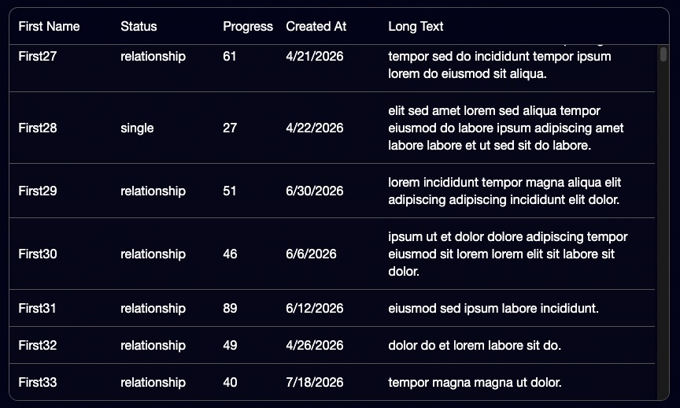

# The Problem

You have a long text in a column, which you have to wrap into multiple lines, which will result in different row heights.




Virtualizing a table is easy when every row is the same height. You know the position of row 50 because it’s just `50 * rowHeight`.

It falls apart when a column wraps long text. You don’t know how tall row 50 is until you’ve measured it — and if you measure in the DOM, rows jump around while you scroll. That’s layout shift, and it shows up in CLS.

I ran into this while wiring TanStack Table + Virtual, and ended up using [pretext](https://github.com/chenglou/pretext) to measure heights ahead of time instead of guessing in the DOM.

## The usual approach (and why I dropped it)

TanStack Virtual’s default path for dynamic sizes is roughly:

1. Estimate a height
2. Render the row
3. Measure it with `measureElement`
4. Correct the scroll position

That works, but the correction is the layout shift. For a dense data grid, that felt worse than a slightly slower first paint.

## Prepare once, layout cheaply

Pretext’s idea is simple: call `prepare()` on the text once, then use `layout()` whenever you need a height for a given width. Don’t re-prepare the same string over and over.

I only prepare cells that actually wrap — marked with `meta.autoHeight` on the column. No point paying for short fields like status or progress.

```js
// only autoHeight columns
if (cell.column.columnDef?.meta?.autoHeight) {
  acc.push({
    size: cell.column.getSize(),
    prepared: prepare(String(cell.getValue()), FONT),
  });
}
```

I’m storing column size next to the prepared text. For this demo the columns are fixed width — no resizing. Resize support needs a different approach; I haven’t done that yet.

## Row height = tallest cell

The virtualizer asks for a size by index. For each prepared cell I run `layout`, then take the max:

```js
const { height } = layout(
  cell.prepared,
  cell.size - GAP * 2, // content width, not border box
  LINE_HEIGHT,
);
return height + GAP * 2; // add vertical padding back
```

That `GAP * 2` bit matters. `layout` wants the **content** width (column width minus left/right padding). Then you add top/bottom padding back so the virtualizer gets the full row height. If your cells use uneven padding, don’t copy this blindly.

Wire it in like this:

```js
const { estimateRowHeight } = usePrepareRows({ rows });

const rowVirtualizer = useVirtualizer({
  count: rows.length,
  estimateSize: estimateRowHeight,
  // no measureElement — we already know the height
  getScrollElement: () => scrollRef.current,
});
```

After that, position rows with `top: virtualRow.start` as usual. Scrollbar stays honest, no jump-on-measure.

## Tradeoffs

This fixed CLS for me. The cost showed up elsewhere: LCP and INP got worse, because preparing thousands of rows keeps the main thread busy before anything paints.

That’s the deal — you’re moving work from scroll time to load time. For ~10k rows with one wrapping column it was noticeable but acceptable in my demo. For larger sets I’d move `prepare` into a Web Worker (the prepared handle is serializable), show a loading state, then keep `layout` on the main thread — that part is cheap.

Column resizing, multi-line cells that aren’t plain text, and mixed paddings are still open questions. I’m not claiming this is the general solution for every grid — it’s what worked for this case.

If you want the full walkthrough, I also recorded a video on this. Demo code lives in the accompanying repo.
